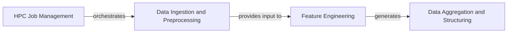

## Details

The Data Processing Pipeline is a fundamental component for the Machine Learning Tool for Behavioral Phenotyping project. It handles the initial stages of data ingestion, transformation, and aggregation, which are crucial for preparing raw DeepLabCut (DLC) tracking data for subsequent machine learning tasks.

### Data Ingestion and Preprocessing

This component is responsible for loading raw DeepLabCut (DLC) tracking data and associated metadata. It performs initial filtering based on probability cutoffs and normalizes the tracking data relative to the beam's position.

**Related Classes/Methods**:

- <a href="https://github.com/Roche/neuro-forestwalk/blob/main/Code/feature_extraction.py" target="_blank" rel="noopener noreferrer">`feature_extraction.py`</a>

- <a href="https://github.com/Roche/neuro-forestwalk/blob/main/Code/utils/beam_walk.py" target="_blank" rel="noopener noreferrer">`utils.beam_walk.Trial.__init__`</a>

- <a href="https://github.com/Roche/neuro-forestwalk/blob/main/Code/utils/beam_walk.py" target="_blank" rel="noopener noreferrer">`utils.beam_walk.Trial._normalizeDlc`</a>

- <a href="https://github.com/Roche/neuro-forestwalk/blob/main/Code/utils/beam_walk.py" target="_blank" rel="noopener noreferrer">`utils.beam_walk.Trial._calculateBeamCoord`</a>

- <a href="https://github.com/Roche/neuro-forestwalk/blob/main/Code/utils/beam_walk.py" target="_blank" rel="noopener noreferrer">`utils.beam_walk.Trial._extractBeam`</a>

### Feature Engineering

This component takes the preprocessed DLC tracking data and transforms it into a rich set of quantitative behavioral features. This includes calculations of distances, angles, and detection of specific behavioral events (e.g., footslips, time to cross).

**Related Classes/Methods**:

- <a href="https://github.com/Roche/neuro-forestwalk/blob/main/Code/utils/beam_walk.py" target="_blank" rel="noopener noreferrer">`utils.beam_walk.Trial._getTimeToCross`</a>

- <a href="https://github.com/Roche/neuro-forestwalk/blob/main/Code/utils/beam_walk.py" target="_blank" rel="noopener noreferrer">`utils.beam_walk.Trial._getFootslips`</a>

### Data Aggregation and Structuring

This component aggregates the extracted behavioral features from multiple experimental trials into a structured dataset, typically a Pandas DataFrame, suitable for machine learning model training and analysis. It also handles the organization and saving of these processed features.

**Related Classes/Methods**:

- <a href="https://github.com/Roche/neuro-forestwalk/blob/main/Code/feature_extraction.py" target="_blank" rel="noopener noreferrer">`feature_extraction.py`</a>

- <a href="https://github.com/Roche/neuro-forestwalk/blob/main/Code/utils/beam_walk.py" target="_blank" rel="noopener noreferrer">`utils.beam_walk.Experiment`</a>

### HPC Job Management

This component is responsible for orchestrating the execution of the data processing pipeline in a High-Performance Computing (HPC) environment. It likely involves scripts that submit jobs, manage dependencies, and handle output.

**Related Classes/Methods**:

- <a href="https://github.com/Roche/neuro-forestwalk/blob/main/Code/feature_extraction.py" target="_blank" rel="noopener noreferrer">`feature_extraction.bsub`</a>

### [FAQ](https://github.com/CodeBoarding/GeneratedOnBoardings/tree/main?tab=readme-ov-file#faq)