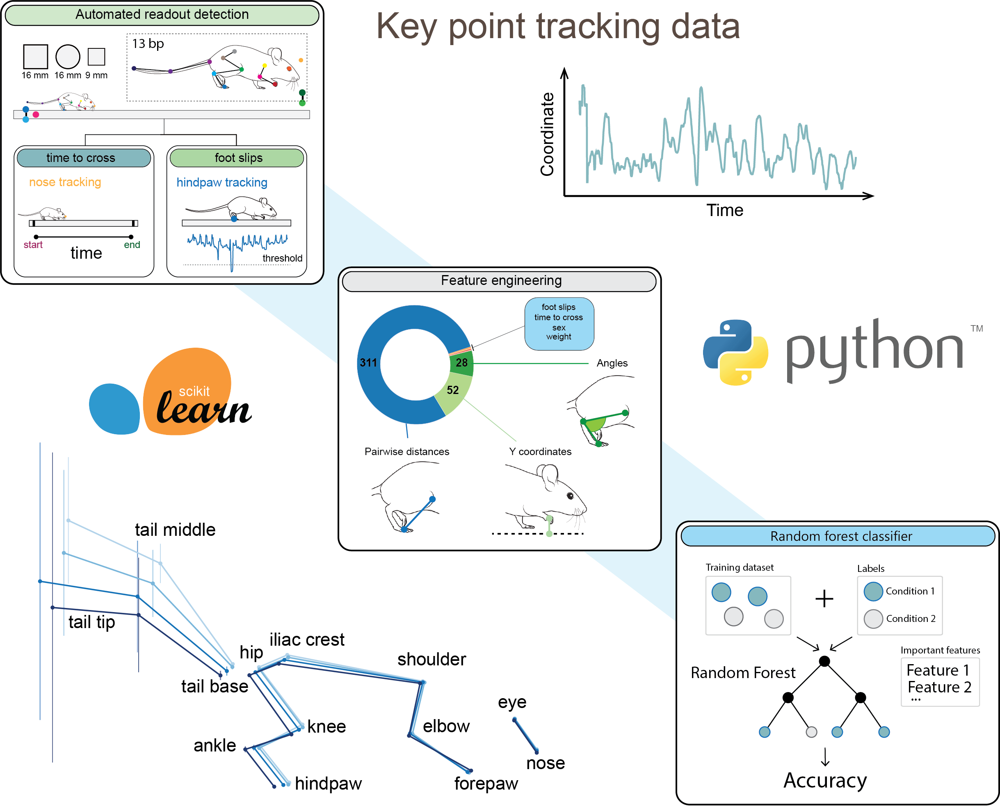
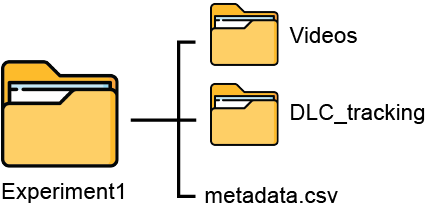

# ForestWalk

# Table of Contents

- [About](#about)
- [Video Naming Conventions](#1-video-naming-conventions)
- [Beam Labeling Conventions](#2-beam-labeling-conventions)
- [Mouse tracking](#3-mouse-tracking)
- [Beam Walking Analysis](#4-beam-walking-analysis)
- [Additional Information](#additional-information)
- [References](#references)
- [Contacts](#contacts)

# About  
ForestWalk is an advanced machine learning-based tool for **enhanced behavioral phenotyping** in the **beam walking test**, providing detailed analysis of mouse movement, posture, and balance through 300+ features to accurately discriminate between distinct biological conditions.  

# ForestWalk Workflow

## 1. Video Naming Conventions
Name each video using the format "date_animalUniqueID_session".

> **Example:**  
> _date_: 08042024  
> _animalUniqueID_: 83649201  (**needs to be an integer, no dashes allowed**)  
> _session_: 01  
> _final name_: 08042024_83649201_01.avi  

## 2. Beam Labeling Conventions  
The analysis describes a beam walking experiment involving three beams each of one meter in length. Users have the discretion to choose the beams' shape and diameter. Each beam is required to be marked with two black stripes that demarcate the middle 80 cm portion. Additionally, two of the beams should have a dot placed near the black stripes—one with the dot on the left and the other with the dot on the right. For an illustrative example, please see the **"Labeled_example"** folder. The system will recognize the beams in the following manner:  

**Beam 1**: Identified by the presence of a dot on its right side.  
**Beam 2**: Identified as the beam lacking a dot.  
**Beam 3**: Identified by the presence of a dot on its left side. 

Users are allowed to assign their own names to the beams.

## 3. Mouse tracking 
In this study, we utilized the open-source platform DeepLabCut to track multiple body parts of mice. If you're interested in using DeepLabCut[[1], [2]], you can find the installation guidelines [here](https://deeplabcut.github.io/DeepLabCut/docs/installation.html). However, you are free to use any other pose estimation software as long as the output conforms to the .h5 file structure used by DeepLabCut. 

Please list the following key points within your chosen pose estimation tool:
- beamLeftUp

- beamLeftDown

- beamRightUp

- beamRightDown

- dot

- nose

- eye

- frontPaw

- elbow

- shoulder

- iliacCrest

- hip

- knee

- ankle

- hindPaw

- tailBase

- tailMiddle

- tailTip

Label them accordingly to the example image provided in the [**Labeled_example**](Labeled_example) folder.

In case DeepLabCut is your chosen tool, you can train a network to detect these coordinates in your videos by following the instructions provided [here](https://deeplabcut.github.io/DeepLabCut/docs/standardDeepLabCut_UserGuide.html).

Our trained network is available for use as a base model and can be found in our [**Zenodo repository**](https://zenodo.org/records/11074826).

## 4. Beam Walking Analysis

### 4.1 Create project folder
For each beam walking experiment, establish a project directory named after the specific experiment.   
Structure the subfolders within this project directory in the following manner:  

**Videos**: gather all the videos recorded during your experiment into this folder.  
**DLC_tracking**: Place the .h5 files generated by DeepLabCut following video prediction into this folder.  
>**Only add tracking data for the trials you plan to analyze; omit tracking from any unsuccessful trials.**

### 4.2 Create metadata.csv file
Then, you will need to generate a .csv file that includes specific columns to catalog the metadata and condition details for each animal in the study. You can find examples of metadata files in our [**Zenodo repository**](https://zenodo.org/records/11074826). 

The metadata file required for the analysis must include the following essential columns:

| Animal_ID | Group_name | Sex | Age | Weight |
|-----------|----------- |-----|-----|--------|
| 38458348  | WT         | F   | 8   | 28.9   |
| 39573247  | KO         | M   | 8   | 36.6   |

>**Animal_ID**: This is a unique numerical identifier for each animal.  
>**Group_name**: Represents the label assigned to various experimental groups within your study. This label will be used to reference >your experimental conditions throughout the analysis process.    
>**Sex**: Indicates the sex of the animal, with 'F' representing female and 'M' representing male.    
>**Age**: Expressed as a number, which in this context denotes the age of the animal in weeks (e.g., 8 weeks).
>**Weight**: The weight is typically given in grams, although the specific unit of measurement is flexible.

### 4.3 Set up the conda environment
Navigate to the **Code** folder in our GitLab repository and clone it to your local machine using the `git clone` command.  
Next, visit the provided deeplabcut [link](https://deeplabcut.github.io/DeepLabCut/docs/installation.html), specifically the section titled **Step 2: Build an Env using our Conda file!**. Download the yaml file that suits your needs and move this file into the Code folder on your local machine.  
Afterward, navigate to the Code folder on your local machine and execute the following command:
`conda env create -f DEEPLABCUT.yaml`
or
`conda env create -f DEEPLABCUT.yaml`
The command you use depends on the name of the file you downloaded.  
Once the environment is successfully created, execute:  
`pip install dlc2kinematics`  
`pip install ranky`

List of required libraries:  

- numpy  
- pandas  
- scipy  
- matplotlib  
- scikit-learn  
- scikit-image  
- seaborn  
- tensorflow  
- h5py  
- pillow  
- jupyter  
- ipywidgets  
- opencv-python  
- dask  
- numba  
- umap-learn  
- napari  
- deeplabcut  

> **Important note**:  
> Should you come across the error message `cannot import name 'binom_test' from 'scipy.stats' `,  while executing the code, navigate to the installation directory of the Ranky package and modify the **duel.py** script. Replace the line `from scipy.stats import binom_test` with `from scipy.stats import binomtest`.

### 4.4 Derive kinematic attributes from the tracking dataset
To begin the ForestWalk analysis, navigate to the Code folder and run the **feature_extraction.py** file by using the job submission script for LSF **feature_extraction.bsub**.

For more information about the **feature_extraction.bsub** file and how to run it, please click [here](#feature_extractionbsub-file).

### 4.5 Select the prioritized features
After completing the feature extraction process, execute the **feature_selection.py** script by using the **feature_selection.bsub** job submission script to identify and select the top features for each animal involved in the experiment.

For more information about the **feature_selection.bsub** file and how to run it, please click [here](#feature_selectionnbsub-file).

The feature selection process is intended for comparing two distinct groups, namely group 1 and group 2, in a binary fashion. For comparisons involving more than two groups, please consult the [multiclass classification section](#multiclass-classification).

### 4.6 Perform the classification
After completing the selection of the prioritized features, execute the **classification.py** script to perform the final classification of each animal in the experiment by using the selected features and a random forest classifier. To do so, use the job submission script **classification.bsub**.

For more information about the **classification.bsub** file and how to run it, please click [here](#classificationbsub-file).

### Output of the Workflow:
The workflow will generate a CSV file that includes the following components:

| Column name  | Description                                                                                |
|-----------------|------------------------------------------------------------------------------------------|
| **test_set**    | Identifier for the test set. | 
| **beam**        | The beam utilized during the trial(s) under analysis. | 
| **animal**      | Unique identifier of the animal predicted by the classifier and corresponding to the test set.|
| **group**       | Experimental group of the animal.|
| **pred_groups** | Predicted group classifications for each trial involving the animal on the given beam.|
| **accuracy**    | The mean accuracy of the classifier's predictions.|
| **prioritized_features**   | The features deemed most important for the animal on the given beam. |
| **all_ranked_features**   | The comprehensive ranking of kinematic features according to their significance for the analysed animal-beam combination. |
| **n_estimators**   | The number of random forest estimators selected through hyperparameter tuning.|
| **min_sample_leaf**   | 	The minimum sample count per leaf node selected through hyperparameter tuning. |
| **max_depth**   | The maximum tree depth chosen during hyperparameter tuning. |
| **max_features**   | 	The upper limit of features to consider when splitting a node, chosen after hyperparameter tuning.|
| **bootstrap**   | The bootstrap approach selected during hyperparameter tuning.|
| **random_state**   | The seed used by the classifier for random number generation.|
| **shared_ranked_features**   | An aggregated ranking of kinematic features from all animals in the study, with the top 50 serving as prioritized features for the experiment.|

The resulting file will be titled _prediction_results_beam1_group1_group2_date_rfe%.csv_ and will reside within the **Results** directory, under a subdirectory corresponding to the beam of interest, such as **beam1** in the given case.

For every animal participating in the experiment, an accuracy metric will be computed by the random forest classifier, indicating the classifier's capability to accurately predict the true experimental group of the animal. By averaging these accuracy metrics, researchers can determine whether the classifier is capable of differentiating between group1 and group2 with greater accuracy than what would be expected by chance, utilizing the provided kinematic features calculated for the specific beam.

Additionally, by reviewing the first 50 items listed under the shared_ranked_features column, researchers can identify a list of prioritized features that play a significant role in distinguishing between group1 and group3 within the context of the specified beam.

### 4.7 Plotting the mouse skeleton

In order to plot the mouse skeleton, run the **Skeleton.ipynb** notebook located in the **Code** folder.  

# Additional Information

## Multiclass classification
If you need to perform the workflow for identifying top features and calculating the final classifier accuracy by comparing more than two groups, please proceed as follows:

1. Launch the **feature_selection_multiclass.py** script by employing the LFS job submission script titled **feature_selection_multiclass.bsub**. For a detailed explanation of the job parameters, click [here](#feature_selectionbsub-file).

2. Following the completion of feature selection, proceed to run the **classification_multiclass.py** using the corresponding job submission script **classification_multiclass.bsub**. Click [here](#classificationbsub-file) for a detailed explanation of the job parameters.

The output produced will align with the output from the standard workflow.

## Optimization of the spatial-temporal criteria for foot slip detection  
We automated foot slip detection by setting spatial and temporal thresholds using the **Threshold_selection.ipynb** notebook.  
By integrating DeepLabCut (DLC) tracking and human-scored foot slips annotations, we chose thresholds that maximized precision and recall against the human-annotated benchmark.

## Feature_extraction.bsub file

> This is a Bash script intended to submit a single job to an LSF (Load Sharing Facility) job scheduler for executing the >feature_extraction.py script. The script is configured to process a set of beams specified by the user, facilitating the feature >extraction phase of the analysis.
> 
> **Prerequisites**:  
> 1. Access to an LSF-based HPC environment.  
> 2. Availability of the _feature_extraction.py_ script and its dependencies in the user's environment.
>
> **Module loading**:  
> The script uses the _ml_ command to load modules, which is part of the Lmod module system. If your HPC environment uses a different >module management system, you will need to modify the module loading commands accordingly. The script specifically requires the >Anaconda3 module to be loaded before activating the Conda environment.
>
> **Modifying Job Parameters**:  
> The job script contains several #BSUB directives that you may need to adjust to suit your computational needs:  
> _-J feat_extraction[1]_: This sets the job array name and index. Modify the index [1] if you plan to run multiple instances in >parallel.  
> - _-R "span[hosts=1]":_ This ensures all tasks are allocated to a single host. Adjust the number within the brackets if a different >allocation is needed.  
> - _-q short_: This specifies the queue to submit the job to. Replace short with the name of the queue that fits your job's priority >and runtime requirements.  
> - _-o output-featExtraction-%J.out_: This sets the name of the output file. Modify it as needed for your file naming conventions.  
> - _-o output-featExtraction-%J.err_: This sets the name of the error file. Modify it as needed for your file naming conventions.
>
> **Modifying Script Parameters:**  
> The script includes a parameters section where you should specify paths and settings for your feature extraction process:  
> - _project_path_: Replace path/to/experiment/folder with the actual path to your experiment data.  
> - _beam_names_: Define the identifiers for the beams you are analyzing. The example provided includes three beams (beam1 beam2 beam3)> , but you should adjust this to match the beams names used in your experiment.
>
> **Submitting the job:**  
> To submit the job to the LSF job scheduler, navigate to the directory containing the script and execute the following command:  `bsub > < feature_extraction.bsub>.
> The job will be placed in the queue and will run when the necessary resources are available. 

## Feature_selection.bsub file

> This is a Bash script designed to submit a job array to an LFS (Load Sharing Facility) job scheduler for running the >_feature_selection.py_ script in parallel across multiple tasks. 
>
> **Prerequisites:**
> 1. Access to an LFS-based HPC environment.    
> 2. Availability of the _feature_selection.py_ script and its dependencies in the user's environment.  
>
> **Module loading:**  
> The script provided utilizes the Lmod system for module loading. If your system does not use Lmod, you will need to adjust this >section of the script to fit your specific module management system. The script requires the Anaconda3 module.
>
> **Modifying Job Parameters:**   
> The job script contains several parameters that you may need to adjust based on your specific needs. For instance:
> - _-J feat_sel[1-32]_: This sets the job array name and range. Modify the range [1-32] to match the number of animals you plan to run in parallel (32 in this example). If for example you are comparing 8 animals from group1 with 8 animals from group2, you should change it to [1-16].    
> - _n 10_: This parameters sets the number of tasks per job. Users can change 10 to a different number as needed.    
> - _R "span[hosts=1]"_: This allocates all tasks to one host. Users can change 1 to a different number as needed.  
> - _-q short_: This selects the queue for the job. Users can change short to a different queue as needed.  
> - _-o output-featSelection-%_:This sets the output file for the job. Users can change it to a different filename as needed.   
> - _-e output-featSelection-%_:This sets the error file for the job. Users can change it to a different filename as needed.
>
> **Modifying Script Parameters:**
> - _project_path_: Replace path/to/experiment/folder with the actual path to your experiment data.
> - _group1, group2_: Specify the names of the two experimental groups that you want to compare, ensuring consistency with the **group >names** you established in the [metadata file](#create-metadatacsv-file).  
> _n_features, beam, random_state, date, rfe_step, n_jobs_: Adjust these parameters to match the specifics of your feature >selection requirements.
> - _shuffle_: Set it to True to run a shuffled version of the script.  
> - _indx_: Set the range of indexes to match the number of animals you are processing.  
> - **(For multiclass only)** _dataset_info_: Replace with the path to the **datasets.csv** file.  
> The datasets.csv file is required to have only one column, titled **datasets**. In this column, you can enter multiple paths, with each path pointing to a different experiment folder you wish to analyze simultaneously. When you provide more than one path, the system will treat each condition within each experiment as a separate group for the classification analysis. If all the groups you want to analyze are within a single experiment folder, then you only need to list one path. Here is an example for illustration:  

| datasets        |
|-----------------|
| complete/path/to/experiment1/folder    |
| complete/path/to/experiment2/folder    |

 

> **Submitting the job:** 
> To submit the job to LSF, you should navigate to the directory containing the script and type:
> `bsub < feature_selection.bsub` or `bsub < feature_selection_multiclass.bsub`  
> The job will then be queued and will execute when the necessary resources become available.

## Classification.bsub file

> #### classification.bsub details:
> This is a Bash script crafted to submit a job array to an LSF (Load Sharing Facility) job scheduler for the purpose of running the classification.py script. The job array is configured to process multiple tasks simultaneously, each pertaining to a different beam, thereby streamlining the classification stage of the analysis workflow.
>
> **Prerequisites**:  
> 1. Access to an LSF-based HPC environment.  
> 2. Availability of the classification.py script and its dependencies in the user's environment.
>
>  **Module loading**:  
> The script uses the ml command to load modules, which is part of the Lmod module system. If your HPC environment uses a different module management system, you will need to modify the module loading commands accordingly. The script specifically requires the Anaconda3 module to be loaded before activating the Conda environment.
>
> **Modifying Job Parameters**:
> - _-J classification[1-3]_: This sets the job array name and range of indexes. Modify the range [1-3] to match the number of beams you plan to run in parallel.
> - _-n 3_: This sets the number of tasks per job. Change 3 to the number of cores you require for each task.
> - _-R "span[hosts=1]"_: This ensures all tasks are allocated to a single host. Adjust the number within the brackets if a different allocation is needed.
> - _-q short_: This specifies the queue to submit the job to. Replace short with the name of the queue that fits your job's priority and runtime requirements.
> - _-o output-%J-classification.out_: This sets the name of the output file. Modify it as needed for your file naming conventions.
> - _-e output-%J-classification.err_: This sets the name of the error file. Modify it as needed for your file naming conventions.
>
> **Modify Script Parameters**:  
> - _project_path_: Replace path/to/experiment/folder with the actual path to your experiment data.
> - _beams_: Define the identifiers for the beams you are analyzing. Adjust the array to match the beams used in your experiment.
> - _group1, group2_: Specify the experimental conditions you are comparing. Ensure these match the group names used in your metadata file.
> - _date_: Users should populate the 'date' field in the file with a suffix that is constituted by the date and the RFE step size they have defined in the feature_selection or feature_selection_multiclass files. This suffix is formed by concatenating the specified date with the RFE step size multiplied by 100. For example, if users have set date=15042023 and rfe_step=0.05 in the feature selection files, the resulting suffix to be filled in the 'date' field would be 15042023_5.      
> - _n_features, data, and n_jobs_: Adjust these parameters according to the specifics of your classification task.
> - _shuffle_: Set this parameter to True if you want to run a shuffled version of the script.  
>
> **Submitting the job**:  
> To submit the job to LSF, you should navigate to the directory containing the script and type:
> `bsub < classification.bsub` or `bsub < classification_multiclass.bsub`
> The job will then be queued and will execute when the necessary resources become available.

# REFERENCES

1. Mathis, A., Mamidanna, P., Cury, K. M., Abe, T., Murthy, V. N., Mathis, M. W., & Bethge, M. (2018). DeepLabCut: markerless pose estimation of user-defined body parts with deep learning. Nature neuroscience, 21(9), 1281–1289. https://doi.org/10.1038/s41593-018-0209-y

2. Nath, T., Mathis, A., Chen, A. C., Patel, A., Bethge, M., & Mathis, M. W. (2019). Using DeepLabCut for 3D markerless pose estimation across species and behaviors. Nature protocols, 14(7), 2152–2176. https://doi.org/10.1038/s41596-019-0176-0

[1]: https://www.nature.com/articles/s41593-018-0209-y "Mathis et al 2018"
[2]: https://www.nature.com/articles/s41596-019-0176-0 "Nath, Mathis et al 2019"

# Contacts  

For any questions or support, please contact us:

- **Name**: Francesca Tozzi  
- **Email**: francesca.tozzi@roche.com

